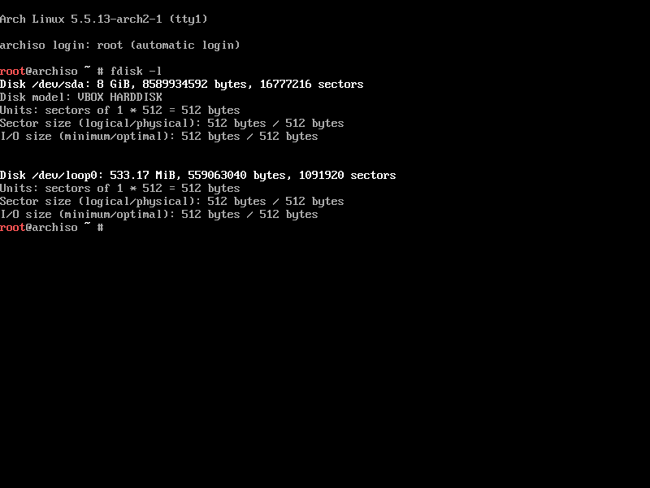
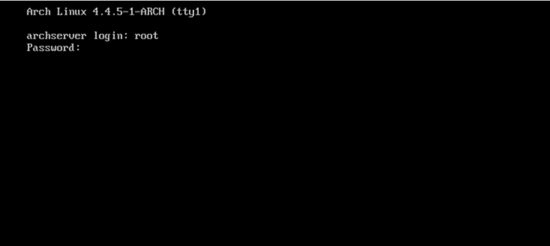

# Guida per Arch Linux (aggiornata Maggio 2020)

[Parte 1: Connessione ad Internet](#parte-1-connessione-ad-internet)  
[Parte 2: Creazione delle partizioni e `pacstrap`](#parte-2-creazione-delle-partizioni-e-pacstrap)  
[Parte 3: Installazione del sistema base e del bootloader](#parte-3-installazione-del-sistema-base-e-del-bootloader)  
[Parte 4: Conclusione e installazione di pacchetti extra](#parte-4-conclusione-e-installazione-di-pacchetti-extra)  
[Parte 5: Riavvio](#parte-5-riavvio)  

## Parte 1: Connessione ad Internet

Prima di iniziare con l'installazione di Arch Linux, è importante verificare di essere connessi ad Internet. Questo è pressoché indispensabile per il download del sistema di base e di altri componenti fondamentali per il boot, quali il kernel e il bootloader.  
Verifichiamo di essere connessi lanciando

```bash
ip addr show
```

Se necessitiamo di conneterci tramite WiFi, lanciamo il comando

```bash
wifi-menu
```

e selezioniamo la nostra rete (attenzione con l'inserimento dei simboli, dato che Arch Linux viene lanciato automaticamente in boot con il locale della tastiera in Inglese).  
Un altro problema che può verificarsi è essere connessi ma non avere un indirizzo IP. Per risolvere lanciamo il demone

```bash
dhcpcd
```

Fatto ciò possiamo passare all'aggiornamento degli indici di repository di Arch. Prima però è consigliato (ma non obbligato) modificare il file `mirrorlist` per selezionare un mirror geograficamente vicino a noi. Per far ciò lanciamo `nano` col comando

```bash
nano /etc/pacman.d/mirrorlist
```

e "scommentiamo" (rimuoviamo i `#`) i mirror italiani/europei. (Ricordiamo: questa operazione è opzionale).  
Dopodiché lanciamo il comando per l'aggiornamento dei repository

```bash
pacman -Syyy
```

## Parte 2: Creazione delle partizioni e `pacstrap`

**IMPORTANTE: Ricordiamo di fare un backup dei dati presenti sul disco prima di procedere con il partizionamento. Questa operazione provocherà l'eliminazione di ogni file presente su di esso.**

Secondo punto di questa guida è la preparazione del nostro disco per l'installazione di Arch. Per i neofiti, questa e l'installazione del bootloader saranno i punti più "preoccupanti" dell'installazione di Arch Linux, cercheremo di essere quindi i più chiari possibili per ogni passaggio che verrà effettuato. In questa guida presenteremo due tipologie di impostazioni, una per i computer dotati di BIOS UEFI e tabella di partizione GPT [(UEFI/GPT)](#partizionamento-per-dispositivi-uefigpt), e un'altra per computer più datati [(BIOS/MBR)](#partizionamento-per-dispositivi-biosmbr).

Detto ciò, iniziamo. Lanciamo il comando

```bash
fdisk -l
```

per osservare l'elenco dei drive e delle loro rispettive partizioni. Per dispositivi di tipo Sata, la denominazione sara `/dev/sda<NUMERO_DELLA_PARTIZIONE>`, per quelli NVME `/dev/nvme0n1p<NUMERO_DELLA_PARTIZIONE>`. In figura un esempio



Fatto ciò possiamo far partire `fdisk` con l'indicazione del nostro disco, ovvero

```bash
fdisk /dev/<NOME_DEL_DISCO>
```

ricordandoci di rimuovere indicazioni riguardo il numero della partizione (solo `sda` o solo `nvme0`).

Entreremo nell'ambiente di lavoro di `fdisk`, riconoscibile dalla riga di prompt

```bash
Command (m for help): 
```

`fdisk` sta aspettando infatti i nostri comandi.

**Questa guida prevederà il partizionamento dell'intero disco per Arch Linux, per doppio boot rivolgersi alla [Wiki ufficiale di Arch](https://wiki.archlinux.org/)**

### Partizionamento per dispositivi UEFI/GPT

Inseriamo il comando 'g' per creare uno tabella di partizioni  di tipo GPT

```bash
Command (m for help): g
```

Dopodiché iniziamo la creazione delle partizioni. Posssiamo creare due tipologie di schemi, uno con due partizioni separate per `root` e per gli utenti, e un altro con la sola partizione di `root`. Consiglio di utilizzare la seconda opzione (la maggior parte delle distribuzioni Linux con installer automatici esegue un partizionamento simile).

| Punto di montaggio sul sistema | Partizione                 | Tipo di partizione GUID   | Attributo di partizione | Dimensione suggerita |
| ------------------------------ | -------------------------- | ------------------------- | ----------------------- | -------------------- |
| `/boot/efi`                    | `/dev/<NOME_DEL_DISCO'1'>` | Partizione di sistema EFI |                         | 500 MiB              |
| `/`                            | `/dev/<NOME_DEL_DISCO'2'>` | Linux                     |                         | Resto del disco      |

Con punto di montaggio del sistema intendiamo quale cartella, sul nostro dispositivo, corrispondera allo schema configurato. `/` è il punto base, o `root`, dal quale ogni sistema Linux accede al resto del sistema, ai punti di montaggio, ai file utente etc.  
Per creare il nostro schema eseguiamo i seguenti comandi in ordine (premendo *invio* alla fine di ciascuno):

```bash
# Per creare la prima partizione (Partizione di boot)
Command (m for help): n
Command (m for help): <premi_invio>
Command (m for help): <premi_invio>
Command (m for help): +500M
Command (m for help): t
Command (m for help): 1

# Per creare la seconda partizione (Partizione di root)
Command (m for help): n
Command (m for help): <premi_invio>
Command (m for help): <premi_invio>
Command (m for help): <premi_invio>
```

Breve spiegazione dei comandi eseguiti. Il comando `n` servirà a creare una nuova partizione. I tre comandi successivi indicano il *numero della partizione*, *l'inizio* e *la fine* della dimensione della partizione. Ogni volta che si crea una partizione il blocco di inizio verrà spostato automaticamente al blocco finale della partizione precedente (ovvero, se creiamo la prima partizione da 0 MiB a 500 MiB, la seconda partizione partirà automaticamente dal blocco di fine della prima a 500 MiB).  
Secondo il nostro schema, abbiamo creato una partizione per i file di boot da 500 MiB e la partizione di root per il resto del nostro spazio disponibile (lasciando il ridimensionamento in automatico con *invio*).  
Per la prima partizione è necessario specificare il tipo, dato che `fdisk` assegana automaticamente il tipo **Linux File System**. Il comando `t` ci permette quindi di cambiarlo, e nel nostro caso selezioniamo `1` assegnarli il tipo **Partizione di sistema EFI** (per la seconda non è necessario).

### Partizionamento per dispositivi BIOS/MBR

Inseriamo il comando 'o' per creare uno tabella di partizioni  di tipo MBR

```bash
Command (m for help): o
```

Dopodiché iniziamo la creazione delle partizioni.  
Consigliamo, come per il partizionamento con tabella GPT, un partizionamento con la sola partizione di `root` per gestire tutti i file di sistema (invece di due partizioni separate per `root` e `home`). Ecco lo schema consigliato

| Punto di montaggio sul sistema | Partizione                 | Tipo di partizione ID | Flag di boot | Dimensione suggerita |
| ------------------------------ | -------------------------- | --------------------- | ------------ | -------------------- |
| `/`                            | `/dev/<NOME_DEL_DISCO'1'>` | Linux                 | **Sì**       | Resto del disco      |

Per il concetto di punto di montaggio rimandiamo alla spiegazione precedente. Eseguiamo ora i comandi per creare il nostro schema di partizioni

```bash
# Per creare la partizione (Partizione di root)
Command (m for help): n
Command (m for help): <premi_invio>
Command (m for help): <premi_invio>
Command (m for help): <premi_invio>

# Per rendere la partizione "chiamabile" in fase di boot (boot flag)
Command (m for help): a
Command (m for help): 1
```

Rispetto al partizionamento effettuato per lo schema GPT, nel caso di BIOS/MBR non abbiamo bisogno di una partizione EFI per conservare importanti informazioni per il boot, basterà la semplice partizione di sistema. Tuttavia dobbiamo abilitare codesta partizione al boot, tramite l'imposizione del flag di boot (il secondo comando in lista).  

> Durante l'utilizzo di `fdisk`, se già sul disco era presente un sistema operativo con relative partizione, potrà spuntare un avviso riguardo il precedente partizionamento presente. Basterà rispondere con 'yes' e continuare con i comandi da effettuare

Finito il partizionamento, possiamo finalmente confermare le nostre operazione lanciando

```bash
Command (m for help): w
```

Passo successivo è la formattazione delle nostre partizioni. Consigliamo di usare il File System `ext4` per le partizioni di tipo Linux Filesystem. (ovvero le partizioni di root precedentemente create). Lanciamo il comando

```bash
mkfs.ext4 /dev/<NOME_DEL_DISCO NUMERO DELLA PARTIZIONE>
```

stando attenti, stavolta, a specificare il numero della partizione desiderata.  
Nel nostro caso UEFI/GPT

```bash
mkfs.ext4 /dev/sda2
```

oppure

```bash
mkfs.ext4 /dev/nvme0n1p2
```

Invece nel nostro caso BIOS/MBR

```bash
mkfs.ext4 /dev/sda1
```

> (non diamo un indicazione per storage di tipo NVME, dato che quest'ultimi sono soliti trovarsi in macchine più moderne, dotate di BIOS UEFI)

Per lo schema che abbiamo creato per UEFI/GPT abbiamo anche una partizione di tipo EFI, che dobbiamo formattare con File System FAT32. Quindi lanciamo il comando

```bash
mkfs.fat -F32 /dev/sda1
```

oppure

```bash
mkfs.fat -F32 /dev/nvme0n1p1
```

sempre relativo al nostro tipo di storage.  
Passaggio successivo è il montaggio delle partizioni. Per adesso ci limiteremo a montare la partizione di root (nel caso GPT, nel caso MBR sarà l'unica da montare). Lanciamo il comando

```bash
mount /dev/<NOME_DEL_DISCO NUMERO_DELLA_PARTIZIONE> /mnt
```

Successivamente creiamo la cartella /etc con

```bash
mkdir /mnt/etc
```

e generiamo il file `fstab` per la nostra tabella partizioni

```bash
genfstab -U -p mnt >> /mnt/etc/fstab
```

Il file `fstab` serve ad un sistema UNIX-like per conoscere le partizioni presente sul disco, e per operare su di esse. Controlliamo che abbia generato una lista corretta lanciando

```bash
cat /mnt/etc/fstab
```

Se tutto è corretto, possiamo passare al lancio di `pacstrap`

```bash
pacstrap -i /mnt base
```

`pacstrap` è uno script che installerà i servizi basilari per un sistema Arch, programmi come `systemd` per l'`init` e simili, ma non il kernel.  

## Parte 3: Installazione del sistema base e del bootloader

Dopo aver preparato il sistema basse con `pacstrap` dobbiamo finire l'installazione del necessario all'interno del nostro sistema. Quindi cambiamo la nostra posizione di root, spostandoci nel nostro sistema finale col comando `chroot`

```bash
arch-chroot /mnt
```

Possiamo adesso lanciare il comando per installare il kernel Linux e dei pacchetti aggiunti come headers e firmware

```bash
pacman -S linux linux-headers linux-firmware
```

e degli utili pacchetti opzionali ma che ci possono servire durante e dopo la configurazione

```bash
pacman -S base-devel openssh nano dialog networkmanager wpa_supplicant wireless_tools netctl dhcpcd
```

`nano` è uno di questi, utile per modificare file di testo da terminale e che useremo nel corso dell'installazione. Altri, come la serie di pacchetti dopo `networkmanager`, saranno utili dopo l'installazione per effettuare una connessione da riga di comando.  
Alcuni di questi pacchetti installano software da inizializzare all'avvio del sistema. Usiamo quindi `systemctl` per abilitarli

```bash
systemctl enable sshd
systemctl enable NetworkManager
```

Fatto ciò iniziamo con la sistemazione dei pacchetti, kernel primo fra questi. Abbiamo sì installato il kernel, tuttavia Linux, in fase di boot, ha bisogno di montare il File System root; questo viene effettuato temporaneamente dal file `initrd` o "Initial Ramdisk". Questo file è importante, dato che può contenere moduli non presenti nel kernel e quindi, a sistema avviato, non utilizzabile per specifi utilizzi (ad esempio, l'uso di una determinata periferica).  

**TL;DR**: Lanciamo il comando per generare il file `initrd`

```bash
mkinitcpio -p linux
```

Passo successivo è la generazione del file per il locale. Facciamo ciò lanciano il comando

```bash
nano /etc/locale.gen
```

e scommentiamo la riga per il locale desiderato (per l'italiano, "# it_IT.UTF-8").  
Per generare il locale eseguiamo

```bash
locale-gen
```

Dopodichè andiamo a settare un password per l'account `root` e creare un utente con password che possa accedere ai permessi di root (ad esempio per operazioni con `sudo`)

```bash
# Per l'account root
passwd # (e seguiamo i passaggi)

# Per creare un utente che abbia anche il permesso di accedere a operazioni di root
useradd -m -g users -G wheel <username>
passwd <username> # (e seguiamo i passaggi)
pacman -S sudo
EDITOR=nano visudo
    # Scommentiamo dal file la riga
    %wheel ALL=(ALL) ALL
```

Passiamo adesso al bootloader. Anche qui, come per il partizionamento, abbiamo due differenti modi in base al bios che il sistema offre. Attenzione, quindi, a seguire le istruzioni per il vostro caso.

```bash
# Per GPT/UEFI
## Installiamo i pacchetti necessari
pacman -S grub efibootmgr dosfstools os-prober mtools

## Creiamo e montiamo la cartella per il Grub
mkdir -p /boot/EFI
mount /dev/<NOME_DEL_DISCO NUMERO DELLA PARTIZIONE> /boot/EFI

## Installiamo Grub
grub-install --target=x86_64-efi --bootloader-id=grub_uefi --recheck

# Per BIOS/MBR
## Installiamo i pacchetti necessari
pacman -S grub

## Installiamo Grub
grub-install --target=i386-pc /dev/<NOME_DEL_DISCO>
```

Dopodiché settiamo il locale per il bootloader

```bash
mkdir /boot/grub/locale
cp /usr/share/locale/en\@quot/LC_MESSAGES/grub.mo /boot/grub/locale/en.mo
```

e generiamo la prima configurazione per Grub.

```bash
grub-mkconfig -o /boot/grub/grub.cfg
```

Passaggio opzionale ma altamente consigliato è la creazione di un file SWAP. I file o le partizioni di SWAP permettono ad un sistema operativo di accedere ad una piccola parte della memoria fisica ed utilizzarla come memoria volatile extra, per non affaticare la sola memoria RAM ed aiutarla nella gestione della memoria volatile totale del sistema.  
Solitamente si riservava una parte del disco con una partizione a sé per lo SWAP, ad oggi è sconsigliato questo metodo e si preferisce (per motivi di stabilià in caso di modifica della dimensione dello SWAP) la creazione di uno swapfile. Per crearlo, eseguiamo i seguenti comandi

```bash
fallocate -l 2G /swapfile
chmod 600 /swapfile
mkswap /swapfile
```

Possiamo sostituire `2G` con la dimensione di SWAP desiderata, 2 GiB sono consigliati per ogni tipo di configurazione. Dopodichè dobbiamo far riconoscere il file nel file `fstab` creato precedentemente. Eseguiamo quindi i comandi

```bash
cp /etc/fstab /etc/fstab.bak
echo '/swapfile none swap sw 0 0' | tee -a /etc/fstab
cat /etc/fstab
```

L'ultimo comando ci permetterà di verificare se abbiamo correttamente inserito la riga all'interno del file `fstab`.  

## Parte 4: Conclusione e installazione di pacchetti extra

### Software extra

Questa è una lista dei pacchetti consigliati da installare dopo un'installazione basica (il comando per installare pacchetti è sempre `pacman -S <nome_pacchetto>`).  
**N.B. alcuni di questi pacchetti, essendo servizi di sistema, devono essere abilitati da `systemctl` per partire all'avvio del sistema.**

#### Durante la fase finale dell'installazione

- Il pacchetto per i microcode Intel o AMD
  - `intel-ucode` oppure `amd-ucode`
- I driver per la propria scheda video
  - `mesa` per schede video Intel integrate o AMD
  - `nvidia` e `nvidia-utils` per schede Nvidia
- `xorg-server` per la gestione delle GUI
- Un desktop environment o window manager di propria scelta (a seguito una lista dei più comuni)
  - GNOME, `gnome`
  - KDE Plasma, `plasma`
  - Budgie, `budgie-desktop`
  - Xfce, `xfce4`
  - LXQt, `lxqt`
  - Cinnamon, `cinnamon`
  - Deepin, `deepin`
- `pulseaudio`, `pulseaudio-alsa` per la gestione del suono

## Parte 5: Riavvio

Il momento della verità. Eseguiamo i seguenti comandi

```bash
exit
umount -a
reboot
```

Se tutti i passaggi sono stati eseguiti correttamente, dovremmo ritrovarci in un ambiente CLI il quale ci chiederà di inserire il nome di un utente e una password



oppure in un ambiente Session Manager installato e abilitato con `systemctl` durante la fase finale di installazione.